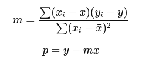

# HubLR

i am working on the 42 project called ft_linear_regression, and i do not understand the sense of this subject. We do the hypothesis of a linear model as y = mx + p. We have a dataset, so due to courses from statistics we have formula to calculate m and p directly. So why do compute a gradient descent? The gradient descent is very interesting to code, but in that case, it is unusefull. If the goal of the subject is to code a gradient descent algo, the title should be gradient_descent and not ft_linear_regression, right?


Excellent question — and you’re 100% right to be confused at first glance.
Let’s unpack what’s going on with ft_linear_regression and why you’re being asked to do gradient descent when the “simple” formulas already exist.

🧠 The math: yes, we can compute m and p directly

For a simple linear regression y=mx+p, you can indeed compute:



Those formulas come from setting the derivative of the cost function to zero and solving analytically — it’s the closed-form solution of the least squares problem.

So if the only goal were to fit a straight line to data, that would be the most efficient way.

⚙️ The reason 42 makes you code gradient descent

The real pedagogical goal of the project isn’t to fit a line — it’s to make you understand machine learning optimization.

Machine learning in the real world almost never allows for such simple closed-form solutions.
In more complex models (e.g., logistic regression, neural networks, etc.), you can’t solve the cost function analytically.
You must approximate the minimum of the cost function numerically — and gradient descent is the fundamental way to do that.

So, the point of ft_linear_regression is:

Learn how gradient descent works by applying it to the simplest possible case (a line).

It’s a “sandbox” for optimization concepts — not a stats exercise.

💡 Why the title “ft_linear_regression” still makes sense

It’s a bit misleading, yes, but the reasoning is:

You are implementing linear regression, conceptually.

The method used to find the coefficients (gradient descent) is what’s being trained.

The focus is on learning how to optimize parameters given a cost function (the MSE).

So, “ft_linear_regression” is the application, and “gradient descent” is the technique you use.

🧩 Analogy

Imagine 42 told you to “build a car,” but the real goal was to make you understand how an engine works.
You wouldn’t just buy an engine — you’d build one from scratch to understand its moving parts.
Same here: gradient descent is the “engine” of most machine learning algorithms.

🧾 TL;DR
Question	Answer
Why not use the direct formula?	Because the goal is to understand optimization, not just fit a line.
Is gradient descent mathematically necessary here?	No, it’s overkill — but it’s educational.
Why is it called ft_linear_regression then?	Because you’re training a linear model, even though the focus is the optimization method.
So what am I really learning?	How to minimize a cost function via gradient descent — the core idea behind all ML.

-----------------------------------------------

On front side, a SPA, i have an index page with 3 buttons to navigate. when i click on. saying data, it loads data.html and data.js, it is ok, but if i come back on the same page it creates and declares same object and same variables again, that is not clean. Other solution is to load everything.js, but it get elements that are there yet because we are on home, and the elements are elements of data, so it does not work. How to solve that messy organisation? Why not break the SPA concept and just creates different pages to work properly?

You’ve spotted the classic SPA problem:
Without a proper component or routing system, dynamic reloading and lifecycle management becomes a mess.


------------------------------------------------------------

if we were not in SPA case, it will reload everything as a first time?

✅ Exactly — and that’s the key difference between **SPA (Single Page Application)** and **MPA (Multi Page Application)**.

Let’s make it crystal clear 👇

---

## 🧱 In a Multi-Page App (non-SPA)

When you click a link like:

```html
<a href="/data.html">Data</a>
```

the browser:

1. **Unloads** the current page entirely (DOM, JS context, memory, variables, listeners — all gone).
2. Sends a new HTTP request to the server for `/data.html`.
3. Loads the new HTML file, parses it, loads its `<script>` tags, and executes all JS from scratch.

✅ Result:

* Every script runs **as if it were the first time**.
* No need to manually “cleanup” or “init” things — the browser does that naturally.
* Each page has a fresh JS context.

---

## 🔁 In a Single-Page App (SPA)

When you simulate navigation (e.g., by dynamically replacing inner HTML):

```js
document.getElementById("main").innerHTML = html;
```

the browser:

* Does **not** unload the page or reset JS.
* Keeps all global variables, event listeners, and imported modules alive.
* Only replaces the DOM fragment you targeted.

⚠️ This means:

* Old event listeners attached to now-deleted DOM elements disappear silently.
* You must manually re-initialize behavior for the new HTML.
* You must clean up the previous page’s state yourself.

---

### 🧩 Summary Table

| Aspect             | Multi-Page App        | Single-Page App           |
| :----------------- | :-------------------- | :------------------------ |
| Page reload        | Full browser reload   | JS swaps content          |
| JS execution       | New context each time | Single long-lived context |
| State persistence  | Lost on navigation    | Stays in memory           |
| Need for cleanup() | No                    | Yes                       |
| Need for init()    | Automatically handled | Manual                    |
| Simplicity         | Easier                | More complex              |
| UX smoothness      | Page reloads          | Instant transitions       |

---

### 🧠 TL;DR

> In a normal multi-page app, each navigation **naturally resets everything** — HTML, JS, and state.
> In a SPA, **nothing resets automatically**, so you must handle lifecycle yourself.

---

So yes — if your app were **not an SPA**, every time you go to `data.html`, the browser would reload and execute `data.js` **as if it were the first time**, automatically cleaning everything up.

-----------------------------------------

fetch() is the right tool to get data or documents,
import() is the right tool to get code or modules.

| Purpose               | Function                    | Returns                    | What it does             |
| --------------------- | --------------------------- | -------------------------- | ------------------------ |
| Load HTML or text     | `fetch()`                   | `Response` → use `.text()` | Gets raw content         |
| Load JavaScript logic | `import()`                  | `Promise` → module         | Loads & executes JS file |
| Example               | `await fetch('data.html')`  | string                     | HTML content             |
| Example               | `await import('./data.js')` | module object              | JS logic loaded          |


-----------------------------------

and why not just set <script src="/js/router.js"></script> in index.html
 is window.navigate = navigate; necessary?

This is one of those “looks simple but has deep consequences” JavaScript module questions 😄

## 🧩 1️⃣ Why `type="module"` was used
When you write:
<script type="module" src="/js/router.js"></script>
you’re telling the browser:
> “This script uses ES Modules (import/export). Please treat it as such.”
That’s necessary **if you use** things like:

```js
import { init } from './data.js';
export function navigate() { ... }
```
Without `type="module"`, that would throw a syntax error, because plain `<script>` cannot use `import` or `export`.

## 🧩 2️⃣ Why `window.navigate` is needed
Inside a module, *nothing is global*.
For example:
```js
export function navigate() { ... }
```
creates a local export — **not** a global function.
So if you have:
```html
<button onclick="navigate('/data')">Go</button>
```
the browser looks for `navigate` in the **global window scope** — and doesn’t find it.
That’s why you get:
> `Uncaught ReferenceError: navigate is not defined`

If you don’t want to `import` it everywhere, then yes — you must explicitly expose it:
```js
window.navigate = navigate;
```
That makes `navigate()` callable from HTML or from any other script (global scope).

## 🧩 3️⃣ What happens if you remove `type="module"`
If you change it to:
```html
<script src="/js/router.js"></script>
```
then:
* ✅ `navigate()` will be global automatically (no need for `window.navigate`),
* ❌ but you **cannot use** `import` or `export` inside that script anymore.
So if `router.js` needs to dynamically import page scripts like:
```js
const module = await import(`./${route.js}`);
```
then you **must** keep `type="module"`.
Otherwise you’ll get:
> `Uncaught SyntaxError: Cannot use import statement outside a module`

## ✅ Summary Table
| Case                     | Can use `import`/`export` | Is `navigate()` global? | Need `window.navigate`? |
| ------------------------ | ------------------------- | ----------------------- | ----------------------- |
| `<script type="module">` | ✅ Yes                     | ❌ No                    | ✅ Yes                   |
| `<script>` (no module)   | ❌ No                      | ✅ Yes                   | ❌ No                    |

So the rule of thumb is:
> If you need `import` or `export`, use `type="module"` **and** `window.navigate = navigate;`

---------------------------------------